

  

# Lumlyn — Pre-MVP Architecture

Acest folder conține **diagramele oficiale** pentru pre-MVP Lumlyn.  
Sunt menținute în trei formate:  
- **.mmd** — sursa în Mermaid (versionabilă)  
- **.drawio** — editabilă în diagrams.net  
- **.png** — export pentru vizualizare rapidă  

Scopul pre-MVP: quiz adaptiv mobil-first, colectare răspunsuri + email, tracking minim (PostHog), manual testing only.

---

## 1) C4 Context

  
**Fișiere:** [`c4-context.mmd`](./c4-context.mmd) • [`c4-context.drawio`](./c4-context.drawio)

**Descriere:**  
Arată actorii principali și limitele de încredere: utilizator → aplicația web (Next.js) → CDN (Vercel Edge) → Supabase (Edge Functions + DB). Integrarea cu servicii externe: PostHog pentru analytics, provider de email pentru colectare lead-uri.  

**Procese reprezentate:**  
- User → Browser → CDN → FE App  
- FE App → Supabase Edge API → Postgres DB  
- Tracking minim → PostHog  
- Lead sync → Email provider  

**Tickete impactate:**  
- [FE] AIT-470 (FE prototype), AIT-469 (UI/UX flow)  
- [BE] AIT-524, AIT-510 (API endpoints), AIT-509 (DB setup)  
- [Analytics] AIT-511 (integrare evenimente minime), AIT-506 (dashboard funnel)  
- [OPS] AIT-507 (arhitectura pre-MVP)  

---

## 2) Component Diagram (High-Level)

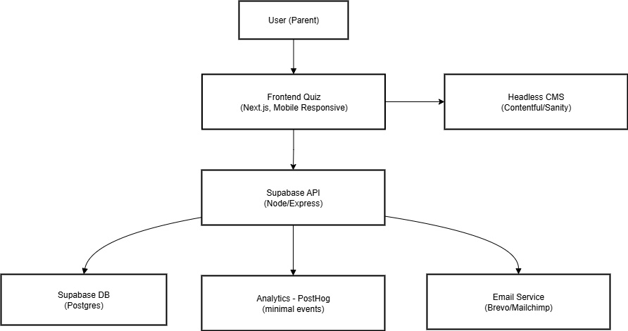  
**Fișiere:** [`component-diagram.mmd`](./component-diagram.mmd) • [`component-diagram.drawio`](./component-diagram.drawio)

**Descriere:**  
Prezintă componentele majore și interacțiunile dintre ele. Frontend-ul Next.js servește quiz-ul, trimite răspunsurile către Edge Functions. Baza de date Supabase stochează sesiunile, răspunsurile și email-urile. Tracking-ul minim merge spre PostHog, iar email-urile se sincronizează cu providerul extern.  

**Procese reprezentate:**  
- FE UI (Intro, Questions, Outro, Email Capture)  
- BE API (GET /quiz, POST /quiz, POST /lead)  
- DB (Users, Sessions, Answers, Leads)  
- Analytics (PostHog minimal events)  
- Email sync  

**Tickete impactate:**  
- [FE] AIT-470 (FE flow, UI states), AIT-469 (UI/UX)  
- [BE] AIT-509 (DB schema), AIT-524, AIT-510 (API endpoints)  
- [Analytics] AIT-511 (event capture subset)  
- [OPS] AIT-507 (arhitectura generală)  

---

## 3) Component Diagram — Detailed

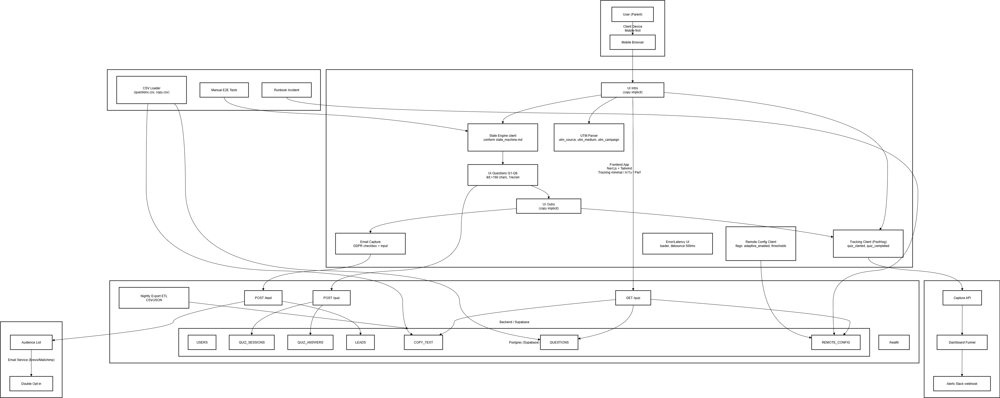  
**Fișiere:** [`component-detailed-diagram.mmd`](./component-detailed-diagram.mmd) • [`component-detailed-diagram.drawio`](./component-detailed-diagram.drawio)

**Descriere:**  
Detaliază fiecare bloc:  
- FE: funcții (`initApp`, `parseUTM`, `runQuizLoop`, `inferIntent`, `pickOutro`, `captureEvent`).  
- BE: API endpoints cu validări și inserții în DB.  
- DB: `QUESTIONS`, `COPY_TEXT`, `QUIZ_SESSIONS`, `QUIZ_ANSWERS`, `LEADS`, `REMOTE_CONFIG`.  
- Integrări: PostHog events whitelisted, Email API, Slack alerts pentru incidente.  
- Ops: CSV loader pentru import content, nightly export pentru ML (ops-only).  

**Procese reprezentate:**  
- Initialization → UTM tagging → Quiz loop → Intent inference → Adaptation → Outro → CTA.  
- API calls validate & save answers/leads.  
- Feature flags controlează flow-ul runtime.  
- Observability: PostHog funnel + Slack alerts.  

**Tickete impactate:**  
- [FE] AIT-470 (funcții quiz), AIT-469 (flow UI), AIT-505 (UTM tagging)  
- [BE] AIT-509 (schema completă), AIT-524, AIT-510 (API validate & save), AIT-505 (campanii)  
- [Analytics] AIT-511 (captureEvent), AIT-506 (funnel dashboards)  
- [OPS] AIT-507 (arhitectura), CSV import (ops ticket), export ML (ops ticket), runbook (incident handling)  

---

## 4) Deployment View

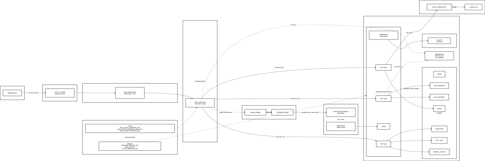  
**Fișiere:** [`deployment-view.mmd`](./deployment-view.mmd) • [`deployment-view.drawio`](./deployment-view.drawio)

**Descriere:**  
Arată distribuția componentelor pe infrastructură:  
- **Vercel Edge**: servește frontend-ul Next.js și rulează cu anon key pentru RLS.  
- **Supabase**: Edge Functions (GET/POST /quiz, POST /lead), Postgres DB, Storage pentru export, Auth (anon vs service role).  
- **Cron job**: nightly export în Storage (ops-only, fără ML consumer).  
- **PostHog Cloud**: colectează evenimente whitelisted.  
- **Email Provider**: API pentru sincronizare lead-uri.  

**Procese reprezentate:**  
- User → CDN → FE → Edge Functions → DB.  
- Rate-limits și CORS middleware în fața Edge Functions.  
- Service role keys doar în Edge Functions (FE = anon only).  
- Export date zilnic → Storage.  

**Tickete impactate:**  
- [FE] AIT-470 (integrarea FE cu API via Edge)  
- [BE] AIT-524, AIT-510 (endpoints integrate), AIT-509 (RLS config), Ops secret mgmt  
- [Analytics] AIT-511 (conexiune PostHog), AIT-506 (event flow funnel)  
- [OPS] AIT-507 (deployment map), ops export ticket, incident runbook  

---

## 5) State Machine (Quiz Flow)

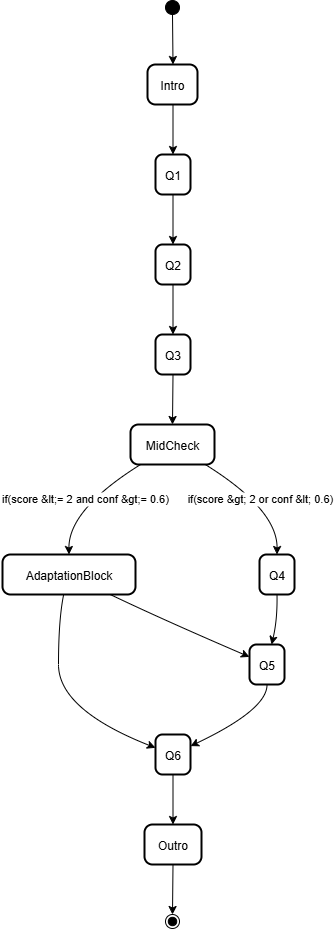  
**Fișiere:** [`state-machine.mmd`](./state-machine.mmd) • [`state-machine.drawio`](./state-machine.drawio)

**Descriere:**  
Definește logica adaptivă a quiz-ului:  
- **Intro** → Q1 → Q2 → (infer intent + sample MidCheck) → Q3–Q6.  
- **MidCheck**: aplică adaptation block max o singură dată (gard de cooldown).  
- **Outro**: selectat în funcție de intent + flag `baby_wording_enabled`.  
- **CTA**: deschide pagina tip, sincronizat cu event whitelisted.  

**Procese reprezentate:**  
- Condiții pentru trigger adaptation: `(score ≤ 2) AND (confidence ≥ threshold) AND cooldown = false`.  
- Sampling pentru MidCheck (configurat via feature flag).  
- Outro variant în funcție de persona detectată.  

**Tickete impactate:**  
- [FE] AIT-470 (implementarea quiz loop), AIT-469 (UI states)  
- [BE] AIT-524 (payload cu flaguri pentru flow), AIT-510 (branching control)  
- [Analytics] AIT-511 (event „quiz_complete”, „quiz_cta_clicked”)  
- [OPS] AIT-507 (logică documentată ca parte din design oficial)  

---

## 6) Sequence Diagram (E2E Flow)

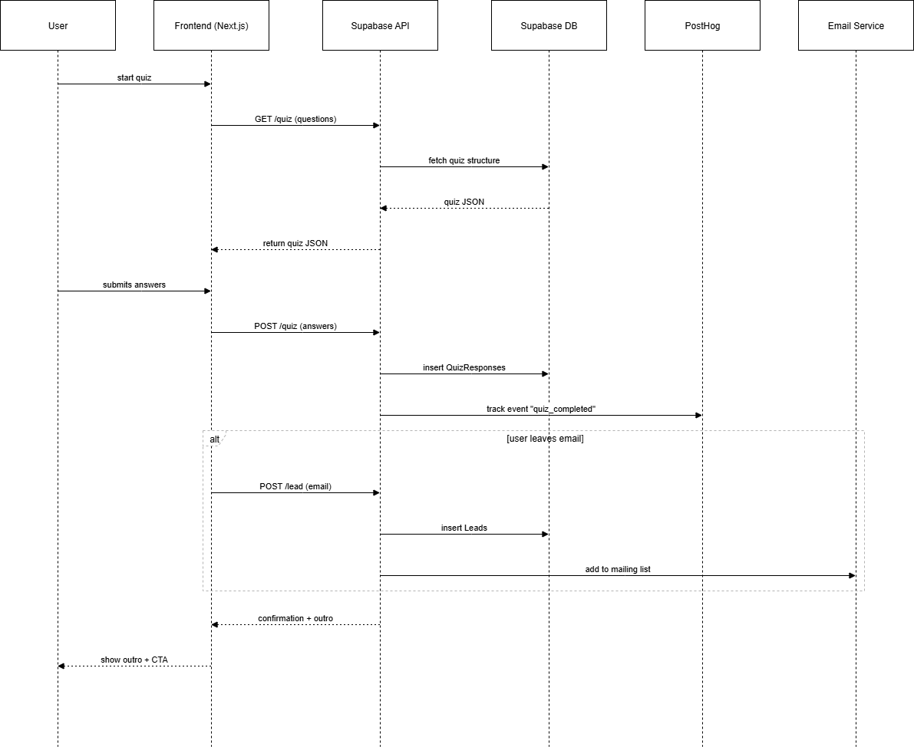  
**Fișiere:** [`sequence-diagram.mmd`](./sequence-diagram.mmd) • [`sequence-diagram.drawio`](./sequence-diagram.drawio)

**Descriere:**  
Ilustrează fluxul end-to-end:  
1. User deschide quiz → FE capture „quiz_intro_shown”.  
2. Start quiz → capture „quiz_start_clicked”.  
3. FE cere conținut: **GET /quiz** → DB → payload cu `questions`, `copy`, `flags_subset`.  
4. User răspunde → FE salvează cu **POST /quiz** → DB inserează sesiune și răspunsuri.  
5. Dacă user lasă email → **POST /lead** → DB + sync către Email Provider.  
6. La final → capture „quiz_complete” + „quiz_cta_clicked”.  

**Procese reprezentate:**  
- Ordinea exactă a requesturilor API.  
- Emiterea evenimentelor whitelisted în PostHog.  
- Condiționalitatea pentru POST /lead.  

**Tickete impactate:**  
- [FE] AIT-470 (frontend calls GET/POST quiz, lead)  
- [BE] AIT-524, AIT-510 (endpoints, flow complet)  
- [Analytics] AIT-511 (momentele emiterii celor 4 eventuri)  
- [OPS] AIT-507 (overview complet integrat)  

---

## 7) ERD (Database Schema)

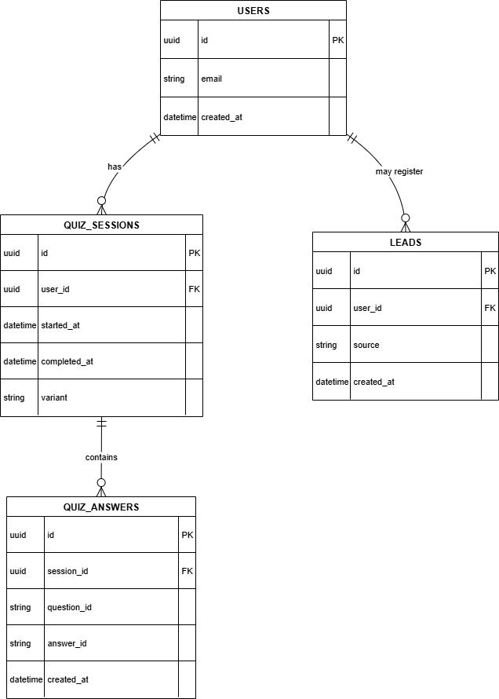  
**Fișiere:** [`ERD.mmd`](./ERD.mmd) • [`ERD.drawio`](./ERD.drawio)

**Descriere:**  
Prezintă tabelele din baza de date Supabase și relațiile lor:  
- **USERS** – utilizatori autentificați (opțional în pre-MVP).  
- **QUIZ_SESSIONS** – stochează metadate pentru fiecare sesiune de quiz (session_id, variant, started_at, completed_at).  
- **QUIZ_ANSWERS** – răspunsurile per întrebare (session_id, question_id, answer_id).  
- **LEADS** – adresele de email + consimțământ și sursa (utm).  
- **QUESTIONS** – întrebările din quiz.  
- **COPY_TEXT** – texte pentru intro/outro, variate pe persona.  
- **REMOTE_CONFIG** – feature flags.  

**Procese reprezentate:**  
- 1:N între QUIZ_SESSIONS și QUIZ_ANSWERS.  
- 1:1 între QUIZ_SESSIONS și LEADS (opțional).  
- Lookup din QUESTIONS și COPY_TEXT la runtime.  
- REMOTE_CONFIG ca tabel mic, accesat la GET /quiz.  

**Tickete impactate:**  
- [FE] AIT-470 (payload de quiz → întrebări, copy text)  
- [BE] AIT-509 (definirea tabelelor), AIT-524, AIT-510 (inserții în sessions/answers/leads)  
- [Analytics] AIT-511 (corelarea event → session_id)  
- [OPS] AIT-507 (schema oficială pre-MVP), CSV import (questions/copy)  

---

## 8) Data Flow

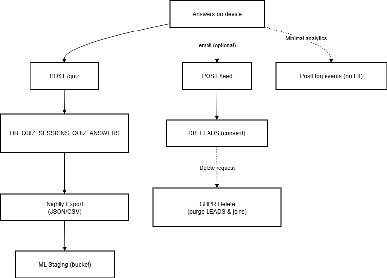  
**Fișiere:** [`data-flow.mmd`](./data-flow.mmd) • [`data-flow.drawio`](./data-flow.drawio)

**Descriere:**  
Arată traseul datelor din momentul în care user interacționează cu quiz-ul până la exportul zilnic:  
- **Device** → trimite răspunsuri către API.  
- **DB** → stochează sessions, answers, leads.  
- **Analytics** → trimite subsetul de evenimente whitelisted către PostHog (fără PII).  
- **Export ops-only** → job nightly → CSV/JSON în Supabase Storage.  
- **Lead data** → sincronizare către Email Provider (doar dacă există consimțământ).  

**Procese reprezentate:**  
- Separarea fluxului de analytics (PostHog) de fluxul de date sensibile (DB).  
- Export pentru ML = manual/ops-only, fără consumator automatizat.  
- Respectarea GDPR (PII doar în Leads, cu consimțământ).  

**Tickete impactate:**  
- [FE] AIT-470 (răspunsuri și email trimise corect)  
- [BE] AIT-524, AIT-510 (inserții corecte în DB, sync către email)  
- [Analytics] AIT-511 (evenimente whitelisted), AIT-506 (funnel dashboards)  
- [OPS] CSV import ticket (input în DB), export ticket (ops job)  

---

## 9) RLS & Access Control

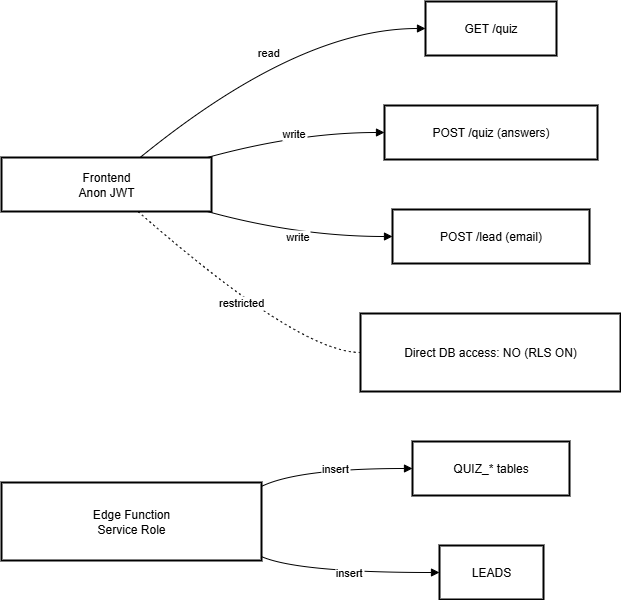  
**Fișiere:** [`rls.mmd`](./rls.mmd) • [`rls.drawio`](./rls.drawio)

**Descriere:**  
Definește regulile de acces la baza de date în Supabase:  
- **Frontend (Next.js)** → folosește **anon key**, acces indirect doar prin API (Edge Functions).  
- **Edge Functions** → rulează cu **service role key**, permit inserții în QUIZ_SESSIONS, QUIZ_ANSWERS, LEADS.  
- **PII protection** → tabelele LEADS, QUIZ_SESSIONS, QUIZ_ANSWERS nu sunt accesibile direct din FE.  
- **Principiul least privilege** → FE vede doar payload-urile pre-filtrate (GET /quiz).  

**Procese reprezentate:**  
- Limitarea accesului la DB în funcție de rol.  
- Serviciile externe (PostHog, Email Provider) nu au acces direct la DB → doar prin API.  

**Tickete impactate:**  
- [FE] AIT-470 (folosește doar API, nu direct DB)  
- [BE] AIT-509 (RLS setup), AIT-524, AIT-510 (Edge Functions cu service role)  
- [Analytics] AIT-511 (asigurarea că doar subsetul whitelisted ajunge în PostHog)  
- [OPS] AIT-507 (arhitectură de securitate documentată)  

---

## 10) Incident / Observability Flow

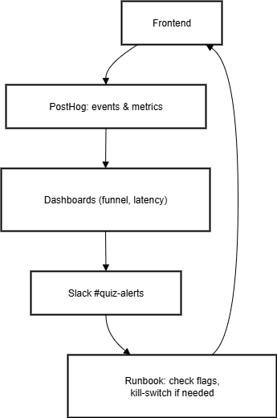  
**Fișiere:** [`incident-flow.mmd`](./incident-flow.mmd) • [`incident-flow.drawio`](./incident-flow.drawio)

**Descriere:**  
Prezintă modul în care sistemul gestionează colectarea de evenimente și incidente operaționale:  
- **Frontend** → trimite evenimente whitelisted către PostHog.  
- **PostHog Dashboard** → monitorizează funnel-ul quiz-ului (Intro → Start → Complete → CTA).  
- **Alerts** → trimise în Slack atunci când funnel rate scade sub praguri definite.  
- **Runbook** → echipa poate aplica rapid măsuri: activare/dezactivare feature flags, ajustare rate-limits sau kill-switch.  

**Procese reprezentate:**  
- Monitoring constant prin PostHog.  
- Notificări automate în Slack pentru anomalii.  
- Măsuri corective prin feature flags, fără redeploy.  

**Tickete impactate:**  
- [FE] AIT-470 (emite evenimente)  
- [BE] AIT-524, AIT-510 (expun endpointuri monitorizate)  
- [Analytics] AIT-511 (definire funnel), AIT-506 (dashboard + alerts)  
- [OPS] AIT-507 (runbook incident), incident ops ticket  

---

## 11) Feature Flags Map

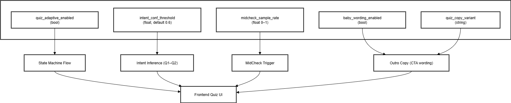  
**Fișiere:** [`feature-flags-map.mmd`](./feature-flags-map.mmd) • [`feature-flags-map.drawio`](./feature-flags-map.drawio)

**Descriere:**  
Prezintă lista de flag-uri runtime controlate din `REMOTE_CONFIG`:  
- **quiz_adaptive_enabled** — activează/dezactivează logica adaptivă.  
- **intent_conf_threshold** — prag de încredere pentru inferența de intent.  
- **midcheck_sample_rate** — procent de utilizatori care primesc MidCheck.  
- **baby_wording_enabled** — activează copy child-friendly la outro.  
- **quiz_copy_variant** — selectează varianta implicită de copy pentru intro/outro.  

**Procese reprezentate:**  
- FE citește payload-ul GET /quiz și aplică flagurile la runtime.  
- BE servește flagurile din DB la request.  
- Analytics corelează rezultatele în PostHog cu starea flagurilor.  

**Tickete impactate:**  
- [FE] AIT-470 (flow adaptiv controlat prin flaguri), AIT-469 (variante UI/UX)  
- [BE] AIT-524, AIT-510 (includ flaguri în payload GET /quiz), AIT-509 (REMOTE_CONFIG table)  
- [Analytics] AIT-511 (analize funnel pe baza variantelor de flaguri)  
- [OPS] AIT-507 (runbook: modificare flaguri), incident ops ticket  

---

## 12) Functions Overview (FE)

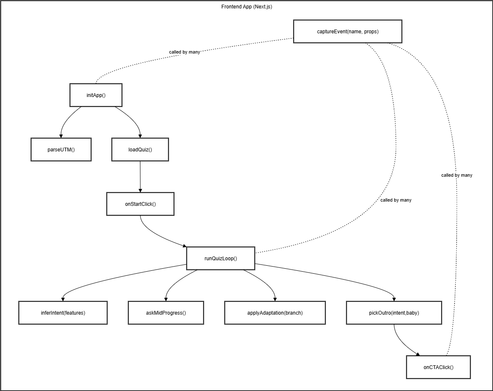  
**Fișiere:** [`functions-overview.mmd`](./functions-overview.mmd) • [`functions-overview.drawio`](./functions-overview.drawio)

**Descriere:**  
Diagrama listează funcțiile cheie din Frontend și relațiile lor:  
- **initApp()** — parsează UTM, pregătește context.  
- **loadQuiz()** — cere conținut de la API.  
- **onStartClick()** — marchează începutul quiz-ului.  
- **runQuizLoop()** — logica principală pentru întrebări, adaptare și outro.  
- **inferIntent()** — calculează profilul (Norman, Torres, Neutral) pe baza răspunsurilor timpurii.  
- **askMidProgress()** — opțional, verifică progresul la jumătate.  
- **applyAdaptation()** — injectează un bloc de adaptare dacă sunt îndeplinite condițiile.  
- **pickOutro()** — selectează varianta de outro pe baza profilului + flag `baby_wording_enabled`.  
- **onCTAClick()** — marchează finalul și deschide tip-ul.  
- **captureEvent()** — trimite evenimente whitelisted către PostHog.  
- **parseUTM()** — parsează parametrii din URL pentru sursă campanie.  

**Procese reprezentate:**  
- Ordinea și dependențele dintre funcțiile FE.  
- Punctele unde se emite tracking.  
- Punctele unde se aplică flagurile runtime.  

**Tickete impactate:**  
- [FE] AIT-470 (implementarea funcțiilor), AIT-469 (flow UI/UX), AIT-505 (UTM tagging)  
- [BE] AIT-524, AIT-510 (payload integrat cu FE funcții)  
- [Analytics] AIT-511 (puncte de emitere eventuri)  
- [OPS] AIT-507 (arhitectura documentată)  

---

