

  

# Lumlyn — Pre-MVP Architecture

Acest folder conține **diagramele oficiale** pentru pre-MVP Lumlyn.  
Sunt menținute în trei formate:  
- **.mmd** — sursa în Mermaid (versionabilă)  
- **.drawio** — editabilă în diagrams.net  
- **.png** — export pentru vizualizare rapidă  

Scopul pre-MVP: quiz adaptiv mobil-first, colectare răspunsuri + email, tracking minim (PostHog), manual testing only.

---

## 📑 Table of Contents

1. [Context](#1-context)  
   - [1.1 C4 Context](#11-c4-context)  
   - [1.2 Component Diagram](#12-component-diagram-high-level)  
   - [1.3 Component Detailed](#13-component-detailed)  

2. [Runtime Flow](#2-runtime-flow)  
   - [2.1 State Machine](#21-state-machine-quiz-flow)  
   - [2.2 Control Flow](#22-control-flow--quiz-loop)  
   - [2.3 Sequence Diagram](#23-sequence-diagram-e2e-flow)  
   - [2.4 Functions Overview](#24-functions-overview-fe)  
   - [2.5 Feature Flags Map](#25-feature-flags-map)  

3. [Backend API](#3-backend-api)  
   - [3.1 GET /quiz](#31-get-quiz--build-payload)  
   - [3.2 POST /quiz](#32-post-quiz--validate--save)  
   - [3.3 POST /lead](#33-post-lead--save--sync)  
   - [3.4 CSV Loader](#34-csv-loader--import-content-versioned)  
   - [3.5 captureEvent](#35-captureevent--minimal-tracking)  
   - [3.6 inferIntent](#36-inferintent--decision-logic)  
   - [3.7 pickOutro](#37-pickoutro--mapping)  

4. [Data & Security](#4-data--security)  
   - [4.1 ERD](#41-erd--database-schema-versioned--ml-ready)  
   - [4.2 RLS](#42-rls--row-level-security--roles)  
   - [4.3 Data Flow](#43-data-flow--collection--storageexport--analytics-no-pii)  
   - [4.4 CORS & Rate Limits](#44-cors--rate-limits--middleware)  

5. [Ops & Observability](#5-ops--observability)  
   - [5.1 Incident Flow](#51-incident-flow--funnel-metrics--fallbacks)  
   - [5.2 Deployment View](#52-deployment-view--with-queues--retries)  
   - [5.3 Runbooks](#53-runbooks-async)  

6. [ML-Ready API](#6-ml-ready-api)  
   - [6.1 ML-Ready API Overview](#61-ml-ready-api-overview)  
   - [6.2 Sequence — /infer](#62-sequence--infer)  
   - [6.3 Sequence — /feedback](#63-sequence--feedback)  

7. [Traceability Matrix](#7-traceability-matrix)
   
---

## 1. Context

### 1.1 C4 Context

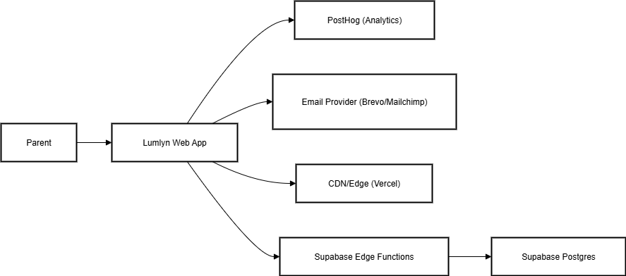

**Fișiere:**  
- [c4-context.mmd](01-context/c4-context.mmd)  
- [c4-context.drawio](01-context/c4-context.drawio)  

**Descriere detaliată:**  
Diagrama C4 arată actorii principali și limitele de încredere:  
- Utilizator → Browser → aplicația web (Next.js, servită din Vercel Edge).  
- API Calls → Supabase Edge Functions (GET/POST quiz, POST lead).  
- DB → Postgres (quiz_sessions, answers, leads, config).  
- Integrare → PostHog (analytics) și Email Provider (lead sync).  

**Procese modelate:**  
- User → FE → API → DB (insert răspunsuri / leads).  
- Tracking minimal → PostHog.  
- Email leads → provider extern.  

**Tickete impactate:**  
- [FE] [AIT-470](https://alexandrafofel.atlassian.net/browse/AIT-470), [AIT-469](https://alexandrafofel.atlassian.net/browse/AIT-469)  
- [BE] [AIT-524](https://alexandrafofel.atlassian.net/browse/AIT-524), [AIT-510](https://alexandrafofel.atlassian.net/browse/AIT-510), [AIT-509](https://alexandrafofel.atlassian.net/browse/AIT-509)  
- [Analytics] [AIT-511](https://alexandrafofel.atlassian.net/browse/AIT-511), [AIT-506](https://alexandrafofel.atlassian.net/browse/AIT-506)  
- [OPS] [AIT-507](https://alexandrafofel.atlassian.net/browse/AIT-507)  

---

### 1.2 Component Diagram (High-Level)

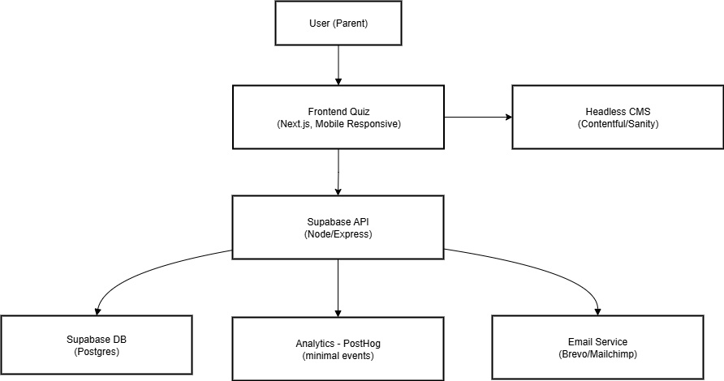

**Fișiere:**  
- [component-diagram.mmd](01-context/component-diagram.mmd)  
- [component-diagram.drawio](01-context/component-diagram.drawio)  

**Descriere detaliată:**  
Arată principalele componente și interacțiunile lor:  
- FE UI (Intro, Questions, Outro, Email Capture).  
- BE API (GET /quiz, POST /quiz, POST /lead).  
- DB (Users, Sessions, Answers, Leads).  
- Analytics (PostHog minimal events).  
- Email Provider (lead sync).  

**Procese modelate:**  
- FE cere întrebări și copy din DB prin API.  
- FE trimite răspunsuri și email la BE → DB.  
- BE trimite subset evenimente la PostHog.  
- BE trimite leaduri către Email Provider.  

**Tickete impactate:**  
- [FE] [AIT-470](https://alexandrafofel.atlassian.net/browse/AIT-470), [AIT-469](https://alexandrafofel.atlassian.net/browse/AIT-469)  
- [BE] [AIT-509](https://alexandrafofel.atlassian.net/browse/AIT-509), [AIT-524](https://alexandrafofel.atlassian.net/browse/AIT-524), [AIT-510](https://alexandrafofel.atlassian.net/browse/AIT-510)  
- [Analytics] [AIT-511](https://alexandrafofel.atlassian.net/browse/AIT-511)  
- [OPS] [AIT-507](https://alexandrafofel.atlassian.net/browse/AIT-507)  

---

### 1.3 Component Detailed

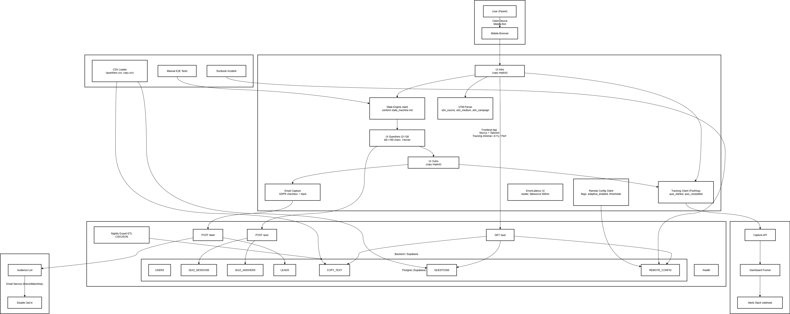

**Fișiere:**  
- [component-detailed-diagram.mmd](01-context/component-detailed-diagram.mmd)  
- [component-detailed-diagram.drawio](01-context/component-detailed-diagram.drawio)  

**Descriere detaliată:**  
Detaliază funcțiile și blocurile:  
- FE: initApp, parseUTM, runQuizLoop, inferIntent, pickOutro, captureEvent.  
- BE: validate & save API endpoints.  
- DB: QUESTIONS, COPY_TEXT, QUIZ_SESSIONS, QUIZ_ANSWERS, LEADS, REMOTE_CONFIG.  
- Integrări: PostHog events whitelisted, Email API, Slack alerts.  
- OPS: CSV loader pentru import content, export nightly pentru ML.  

**Procese modelate:**  
- Initialization → quiz loop → infer intent → adaptare → outro → CTA.  
- API calls → validate & insert.  
- Observability: PostHog funnel + Slack alerts.  
- OPS jobs: import/export.  

**Tickete impactate:**  
- [FE] [AIT-470](https://alexandrafofel.atlassian.net/browse/AIT-470), [AIT-469](https://alexandrafofel.atlassian.net/browse/AIT-469), [AIT-505](https://alexandrafofel.atlassian.net/browse/AIT-505)  
- [BE] [AIT-509](https://alexandrafofel.atlassian.net/browse/AIT-509), [AIT-524](https://alexandrafofel.atlassian.net/browse/AIT-524), [AIT-510](https://alexandrafofel.atlassian.net/browse/AIT-510)  
- [Analytics] [AIT-511](https://alexandrafofel.atlassian.net/browse/AIT-511), [AIT-506](https://alexandrafofel.atlassian.net/browse/AIT-506)  
- [OPS] [AIT-507](https://alexandrafofel.atlassian.net/browse/AIT-507), CSV Import, Export Ops  

---

## 2. Runtime Flow

### 2.1 State Machine (Quiz Flow)

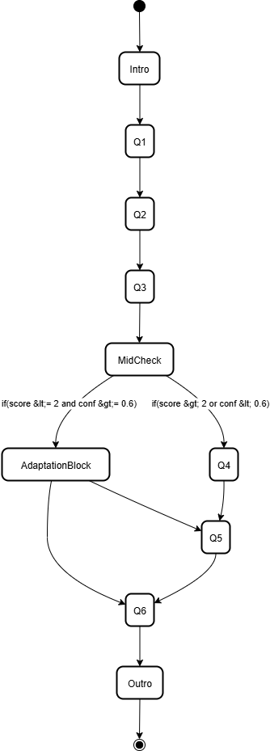

**Fișiere:**  
- [state-machine.mmd](02-runtime-flow/state-machine.mmd)  
- [state-machine.drawio](02-runtime-flow/state-machine.drawio)  

**Descriere detaliată:**  
Definește logica adaptivă a quiz-ului:  
- **Intro → Q1 → Q2 → inferIntent + optional MidCheck → Q3–Q6 → Outro → CTA**  
- MidCheck se aplică doar o dată, controlat de flag + cooldown.  
- Outro-ul e ales în funcție de intent (Norman, Torres, Neutral) și flagul `baby_wording_enabled`.  
- CTA marchează completarea quiz-ului și deschide tip page.  

**Procese modelate:**  
- Condițiile pentru injectarea Adaptation Block.  
- Punctele unde se emit evenimente whitelisted (start, complete, CTA).  
- Branching logică finală în Outro.  

**Tickete impactate:**  
- [FE] [AIT-470](https://alexandrafofel.atlassian.net/browse/AIT-470), [AIT-469](https://alexandrafofel.atlassian.net/browse/AIT-469)  
- [BE] [AIT-524](https://alexandrafofel.atlassian.net/browse/AIT-524), [AIT-510](https://alexandrafofel.atlassian.net/browse/AIT-510)  
- [Analytics] [AIT-511](https://alexandrafofel.atlassian.net/browse/AIT-511)  
- [OPS] [AIT-507](https://alexandrafofel.atlassian.net/browse/AIT-507)  

---

### 2.2 Control Flow — Quiz Loop

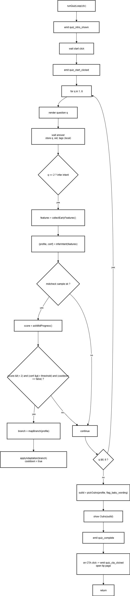

**Fișiere:**  
- [control-flow-w-state-machine.mmd](02-runtime-flow/control-flow-w-state-machine.mmd)  
- [control-flow-w-state-machine.drawio](02-runtime-flow/control-flow-w-state-machine.drawio)  

**Descriere detaliată:**  
Detaliază implementarea `runQuizLoop()`:  
- Intro și Start → emitere evenimente.  
- Loop Q1–Q6 → la Q2 se face inferIntent.  
- MidCheck (opțional) → aplică Adaptation Block dacă condițiile sunt îndeplinite.  
- Outro + CTA → finalizează sesiunea și emite eventuri.  

**Procese modelate:**  
- Guard condition pentru Adaptation (max o dată).  
- Call-uri către `captureEvent()` pentru PostHog.  
- CTA ca ultim pas din flow.  

**Tickete impactate:**  
- [FE] [AIT-470](https://alexandrafofel.atlassian.net/browse/AIT-470), [AIT-469](https://alexandrafofel.atlassian.net/browse/AIT-469)  
- [Analytics] [AIT-511](https://alexandrafofel.atlassian.net/browse/AIT-511)  

---

### 2.3 Sequence Diagram (E2E Flow)

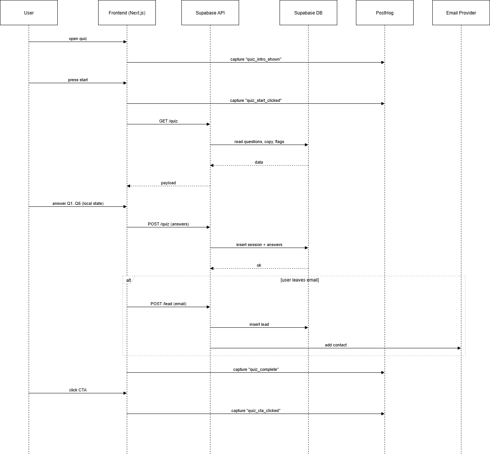

**Fișiere:**  
- [sequence-diagram.mmd](02-runtime-flow/sequence-diagram.mmd)  
- [sequence-diagram.drawio](02-runtime-flow/sequence-diagram.drawio)  

**Descriere detaliată:**  
Arată fluxul end-to-end dintre User, FE, BE, DB, PostHog și Email Provider:  
1. User începe quiz → FE emite `quiz_intro_shown`.  
2. Start → `quiz_start_clicked`.  
3. FE → GET /quiz → DB → întrebări + copy + flags.  
4. FE → POST /quiz → DB salvează answers și session.  
5. FE → POST /lead → DB + sync către Email Provider.  
6. Final → `quiz_complete`, `quiz_cta_clicked`.  

**Procese modelate:**  
- Ordinea apelurilor API.  
- Emiterea trackingului whitelisted.  
- Condiționalitatea pentru POST /lead.  

**Tickete impactate:**  
- [FE] [AIT-470](https://alexandrafofel.atlassian.net/browse/AIT-470)  
- [BE] [AIT-524](https://alexandrafofel.atlassian.net/browse/AIT-524), [AIT-510](https://alexandrafofel.atlassian.net/browse/AIT-510)  
- [Analytics] [AIT-511](https://alexandrafofel.atlassian.net/browse/AIT-511)  
- [OPS] [AIT-507](https://alexandrafofel.atlassian.net/browse/AIT-507)  

---

### 2.4 Functions Overview (FE)

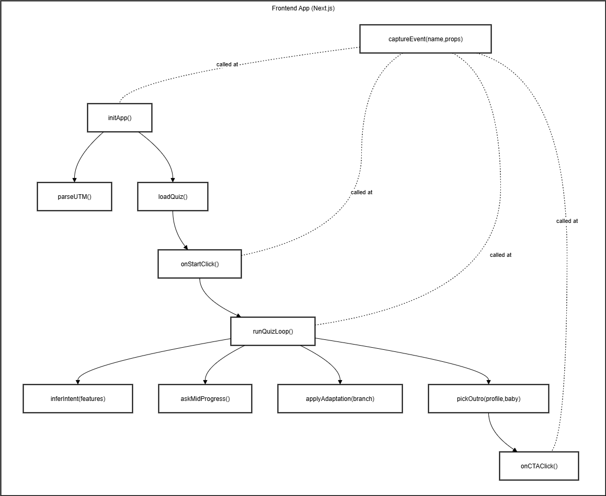

**Fișiere:**  
- [functions-overview.mmd](02-runtime-flow/functions-overview.mmd)  
- [functions-overview.drawio](02-runtime-flow/functions-overview.drawio)  

**Descriere detaliată:**  
Listează funcțiile cheie FE și dependențele lor:  
- `initApp()` → parseUTM, pregătește context.  
- `loadQuiz()` → cere conținut de la API.  
- `runQuizLoop()` → logica principală.  
- `inferIntent()`, `askMidProgress()`, `applyAdaptation()`, `pickOutro()`.  
- `onCTAClick()` → finalizează flow-ul.  
- `captureEvent()` → trimite eventurile whitelisted.  

**Procese modelate:**  
- Ordinea execuției funcțiilor.  
- Punctele de tracking.  
- Aplicarea flagurilor runtime.  

**Tickete impactate:**  
- [FE] [AIT-470](https://alexandrafofel.atlassian.net/browse/AIT-470), [AIT-469](https://alexandrafofel.atlassian.net/browse/AIT-469), [AIT-505](https://alexandrafofel.atlassian.net/browse/AIT-505)  
- [Analytics] [AIT-511](https://alexandrafofel.atlassian.net/browse/AIT-511)  

---

### 2.5 Feature Flags Map

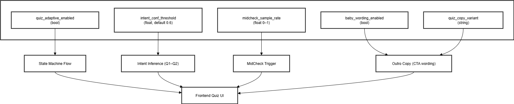

**Fișiere:**  
- [feature-flags-map.mmd](02-runtime-flow/feature-flags-map.mmd)  
- [feature-flags-map.drawio](02-runtime-flow/feature-flags-map.drawio)  

**Descriere detaliată:**  
Listează flagurile runtime controlate din `REMOTE_CONFIG`:  
- `quiz_adaptive_enabled`  
- `intent_conf_threshold`  
- `midcheck_sample_rate`  
- `baby_wording_enabled`  
- `quiz_copy_variant`  

**Procese modelate:**  
- BE include flaguri în payload GET /quiz.  
- FE aplică flaguri la runtime.  
- Analytics corelează funnel results cu starea flagurilor.  

**Tickete impactate:**  
- [FE] [AIT-470](https://alexandrafofel.atlassian.net/browse/AIT-470), [AIT-469](https://alexandrafofel.atlassian.net/browse/AIT-469)  
- [BE] [AIT-524](https://alexandrafofel.atlassian.net/browse/AIT-524), [AIT-510](https://alexandrafofel.atlassian.net/browse/AIT-510), [AIT-509](https://alexandrafofel.atlassian.net/browse/AIT-509)  
- [Analytics] [AIT-511](https://alexandrafofel.atlassian.net/browse/AIT-511)  
- [OPS] [AIT-507](https://alexandrafofel.atlassian.net/browse/AIT-507)  

---

## 3. Backend API

### 3.1 GET /quiz — Build Payload

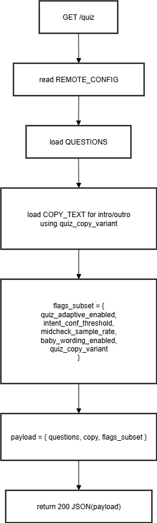

**Fișiere:**  
- [get-quiz-build-payload-from-DB-and-flags.mmd](03-backend-api/get-quiz-build-payload-from-DB-and-flags.mmd)  
- [get-quiz-build-payload-from-DB-and-flags.drawio](03-backend-api/get-quiz-build-payload-from-DB-and-flags.drawio)  

**Descriere detaliată:**  
- Interoghează `QUESTIONS` și `COPY_TEXT` filtrat pe `version`.  
- Adaugă flaguri runtime din `REMOTE_CONFIG`.  
- Returnează payload complet către FE (questions, copy, flags).  

**Tickete impactate:**  
- [BE] [AIT-524](https://alexandrafofel.atlassian.net/browse/AIT-524), [AIT-510](https://alexandrafofel.atlassian.net/browse/AIT-510), [AIT-509](https://alexandrafofel.atlassian.net/browse/AIT-509)  
- [FE] [AIT-470](https://alexandrafofel.atlassian.net/browse/AIT-470)  

---

### 3.2 POST /quiz — Validate & Save

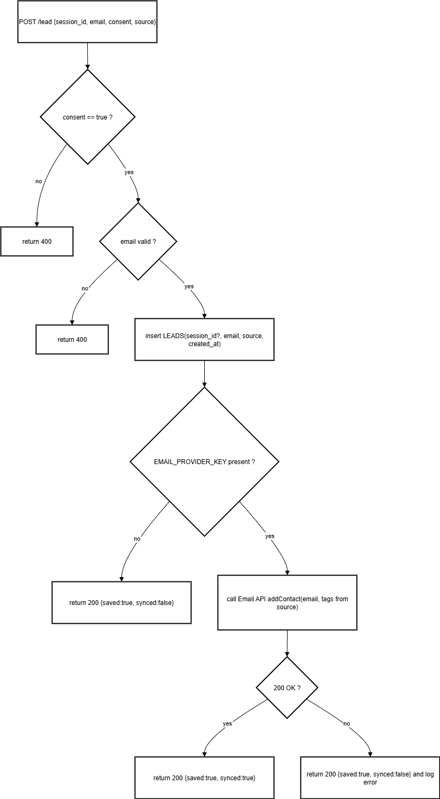

**Fișiere:**  
- [post-quiz-validate-save.mmd](03-backend-api/post-quiz-validate-save.mmd)  
- [post-quiz-validate-save.drawio](03-backend-api/post-quiz-validate-save.drawio)  

**Descriere detaliată:**  
- Validează `session_id` și structura răspunsurilor.  
- Creează sau actualizează `QUIZ_SESSIONS`.  
- Iterează răspunsurile și inserează în `QUIZ_ANSWERS`.  
- Marchează `completed_at` la final.  

**Tickete impactate:**  
- [BE] [AIT-524](https://alexandrafofel.atlassian.net/browse/AIT-524), [AIT-510](https://alexandrafofel.atlassian.net/browse/AIT-510)  
- [FE] [AIT-470](https://alexandrafofel.atlassian.net/browse/AIT-470)  

---

### 3.3 POST /lead — Save & Sync

**Fișiere:**  
- [post-lead-save-sync.mmd](03-backend-api/post-lead-save-sync.mmd)  
- [post-lead-save-sync.drawio](03-backend-api/post-lead-save-sync.drawio)  

**Descriere detaliată:**  
- Validează consimțământul și email-ul.  
- Salvează în `LEADS` (session_id, email, consent, synced=false).  
- Încearcă sync către Email Provider.  
- Dacă eșuează → `synced=false` rămâne și un retry job îl va reîncerca.  

**Tickete impactate:**  
- [BE] [AIT-524](https://alexandrafofel.atlassian.net/browse/AIT-524), [AIT-510](https://alexandrafofel.atlassian.net/browse/AIT-510)  
- [FE] [AIT-470](https://alexandrafofel.atlassian.net/browse/AIT-470)  
- [OPS] Export/retry job (runbook)  

---

### 3.4 CSV Loader — Import Content (Versioned)

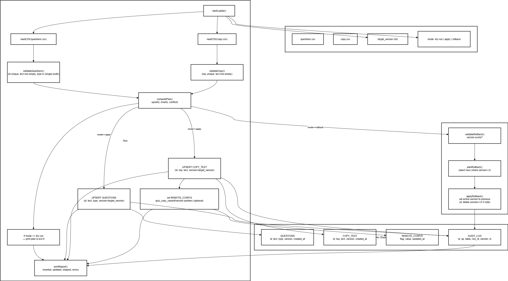

**Fișiere:**  
- [csv-loader-import-content.mmd](03-backend-api/csv-loader-import-content.mmd)  
- [csv-loader-import-content.drawio](03-backend-api/csv-loader-import-content.drawio)  

**Descriere detaliată:**  
- Rulează în modurile: `dry-run`, `apply`, `rollback`.  
- Validează unicitatea și consistența inputului.  
- `apply` → face **UPSERT** cu `version=target_version`.  
- `rollback` → revine la versiunea precedentă.  
- Scrie toate operațiunile în `AUDIT_LOG`.  

**Tickete impactate:**  
- [OPS] CSV Import (Ops)  
- [BE] [AIT-509](https://alexandrafofel.atlassian.net/browse/AIT-509)  

---

### 3.5 captureEvent() — Minimal Tracking

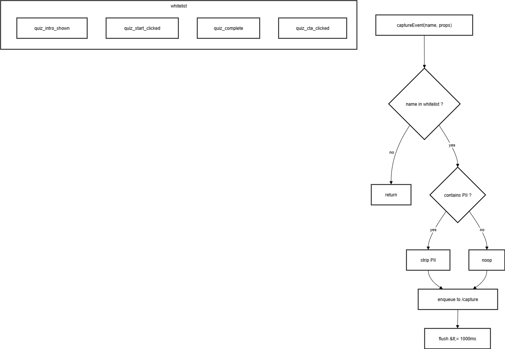

**Fișiere:**  
- [captureEvent–min-tracking-PostHog.mmd](03-backend-api/captureEvent–min-tracking-PostHog.mmd)  
- [captureEvent–min-tracking-PostHog.drawio](03-backend-api/captureEvent–min-tracking-PostHog.drawio)  

**Descriere detaliată:**  
- Acceptă doar eventurile whitelisted: `quiz_intro_shown`, `quiz_start_clicked`, `quiz_complete`, `quiz_cta_clicked`.  
- Filtrează orice PII.  
- Trimite batch către PostHog.  
- Fallback dacă PostHog e indisponibil → local queue + retry.  

**Tickete impactate:**  
- [FE] [AIT-470](https://alexandrafofel.atlassian.net/browse/AIT-470)  
- [Analytics] [AIT-511](https://alexandrafofel.atlassian.net/browse/AIT-511), [AIT-506](https://alexandrafofel.atlassian.net/browse/AIT-506)  

---

### 3.6 inferIntent — Decision Logic

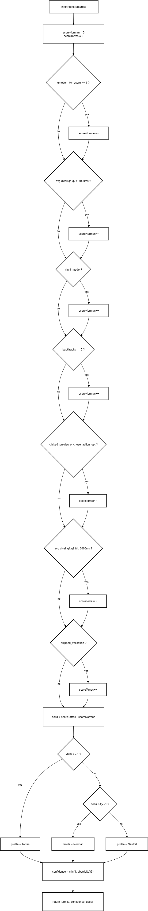

**Fișiere:**  
- [inferIntent-features-decision.mmd](03-backend-api/inferIntent-features-decision.mmd)  
- [inferIntent-features-decision.drawio](03-backend-api/inferIntent-features-decision.drawio)  

**Descriere detaliată:**  
- Preia feature-uri timpurii (emoții, dwell time, backtracks).  
- Calculează scor Norman vs Torres.  
- Returnează intent + confidence.  
- Confidence agregat → raportat în KPIs.  

**Tickete impactate:**  
- [FE] [AIT-470](https://alexandrafofel.atlassian.net/browse/AIT-470)  
- [Analytics] [AIT-511](https://alexandrafofel.atlassian.net/browse/AIT-511)  

---

### 3.7 pickOutro — Mapping

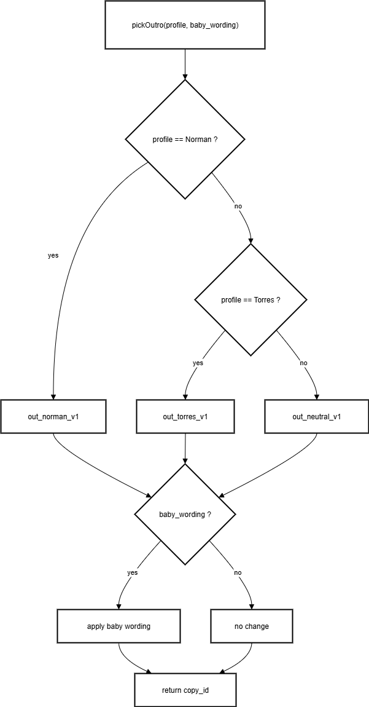

**Fișiere:**  
- [pick-outro-mapping.mmd](03-backend-api/pick-outro-mapping.mmd)  
- [pick-outro-mapping.drawio](03-backend-api/pick-outro-mapping.drawio)  

**Descriere detaliată:**  
- Alege Outro pe baza intentului:  
  - Norman → out_norman_v1  
  - Torres → out_torres_v1  
  - Neutral → out_neutral_v1  
- Dacă `baby_wording_enabled` = true → se aplică copy child-friendly.  

**Tickete impactate:**  
- [FE] [AIT-470](https://alexandrafofel.atlassian.net/browse/AIT-470)  
- [BE] [AIT-524](https://alexandrafofel.atlassian.net/browse/AIT-524)  
---

## 4. Data & Security

### 4.1 ERD — Database Schema (versioned + ML-ready)

**Fișiere:**  
- [ERD.mmd](04-data-and-security/ERD.mmd)  
- [ERD.drawio](04-data-and-security/ERD.drawio)  

**Descriere detaliată:**  
Schema DB include tabelele pre-MVP și extensiile pentru versionare și ML-ready:  
- **QUIZ_SESSIONS** — sesiuni (id, variant, started_at, completed_at, source).  
- **QUIZ_ANSWERS** — răspunsuri (session_id, question_id, answer_id).  
- **LEADS** — email-uri cu consimțământ și **synced** (retry dacă provider-ul pică).  
- **QUESTIONS** (cu **version**) — suport pentru A/B / rollback.  
- **COPY_TEXT** (cu **version**) — variantarea textelor intro/outro.  
- **REMOTE_CONFIG** — feature flags runtime.  
- **FEEDBACK** — etichete manuale pentru ML (label_type/value, note).  
- **INFER_LOGS** — log request/response pentru `/infer` (latency, payload-uri).  

**Procese modelate:**  
- 1:N **QUIZ_SESSIONS → QUIZ_ANSWERS**.  
- 0/1:N **QUIZ_SESSIONS → LEADS / FEEDBACK / INFER_LOGS**.  
- Versionare pe conținut: `QUESTIONS.version`, `COPY_TEXT.version`.  

**Tickete impactate:**  
- [BE] [AIT-509](https://alexandrafofel.atlassian.net/browse/AIT-509), [AIT-524](https://alexandrafofel.atlassian.net/browse/AIT-524), [AIT-510](https://alexandrafofel.atlassian.net/browse/AIT-510)  
- [FE] [AIT-470](https://alexandrafofel.atlassian.net/browse/AIT-470)  
- [Analytics] [AIT-511](https://alexandrafofel.atlassian.net/browse/AIT-511)  
- [OPS] CSV Import (Ops), Export Ops  

---

### 4.2 RLS — Row Level Security & Roles

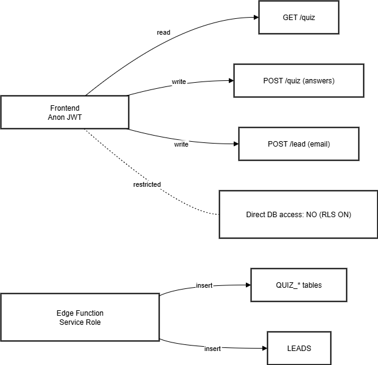

**Fișiere:**  
- [rls.mmd](04-data-and-security/rls.mmd)  
- [rls.drawio](04-data-and-security/rls.drawio)  

**Descriere detaliată:**  
- **Frontend (Next.js)** folosește **anon key** → acces strict prin Edge Functions.  
- **Edge Functions** rulează cu **service role** → pot insera în `QUIZ_*` și `LEADS`.  
- **PII isolation**: FE nu vede niciodată tabelele sensibile; doar payload-uri pregătite de BE (GET /quiz).  
- **Principiul least privilege** + limite clare pentru servicii externe (PostHog/Email fără acces DB).  

**Procese modelate:**  
- Limitarea accesului în funcție de rol (anon vs service role).  
- Interdicția de acces direct din FE la tabelele cu PII.  

**Tickete impactate:**  
- [BE] [AIT-509](https://alexandrafofel.atlassian.net/browse/AIT-509), [AIT-524](https://alexandrafofel.atlassian.net/browse/AIT-524), [AIT-510](https://alexandrafofel.atlassian.net/browse/AIT-510)  
- [FE] [AIT-470](https://alexandrafofel.atlassian.net/browse/AIT-470)  
- [Analytics] [AIT-511](https://alexandrafofel.atlassian.net/browse/AIT-511)  
- [OPS] [AIT-507](https://alexandrafofel.atlassian.net/browse/AIT-507)  

---

### 4.3 Data Flow — Collection → Storage/Export → Analytics (no PII)

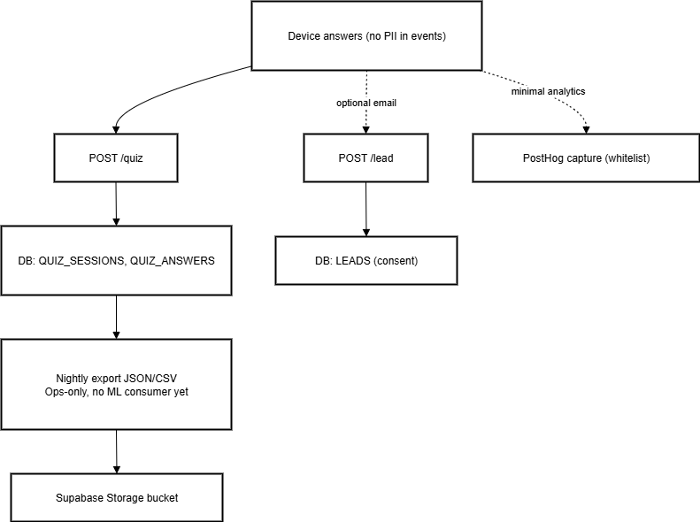

**Fișiere:**  
- [data-flow.mmd](04-data-and-security/data-flow.mmd)  
- [data-flow.drawio](04-data-and-security/data-flow.drawio)  

**Descriere detaliată:**  
- **Colectare**: FE trimite răspunsuri (POST /quiz) și lead (POST /lead).  
- **Stocare**: DB salvează sessions, answers, leads (cu consent).  
- **Analytics**: evenimente **whitelisted** către PostHog (fără PII).  
- **Export**: job nightly → JSON/CSV în **Storage** (*ops-only*, fără ML consumer automat).  

**Procese modelate:**  
- Separarea clară a fluxului de analytics (no PII) de fluxul de PII (DB).  
- Exporturi controlate pentru antrenare ulterioară (manual/ops).  

**Tickete impactate:**  
- [BE] [AIT-524](https://alexandrafofel.atlassian.net/browse/AIT-524), [AIT-510](https://alexandrafofel.atlassian.net/browse/AIT-510)  
- [FE] [AIT-470](https://alexandrafofel.atlassian.net/browse/AIT-470)  
- [Analytics] [AIT-511](https://alexandrafofel.atlassian.net/browse/AIT-511), [AIT-506](https://alexandrafofel.atlassian.net/browse/AIT-506)  
- [OPS] Export Ops  

---

### 4.4 CORS & Rate Limits — Middleware

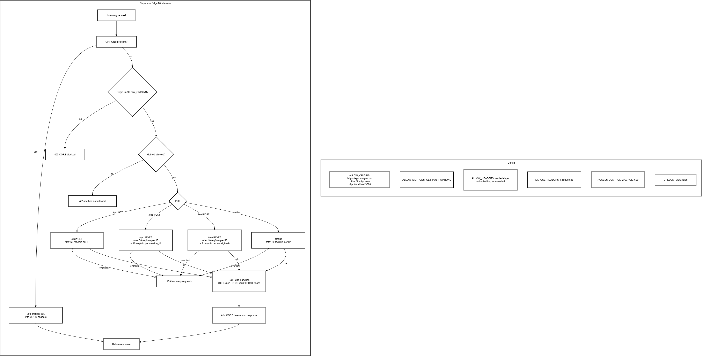

**Fișiere:**  
- [cors-and-rate-limits.mmd](04-data-and-security/cors-and-rate-limits.mmd)  
- [cors-and-rate-limits.drawio](04-data-and-security/cors-and-rate-limits.drawio)  

**Descriere detaliată:**  
- **CORS**: `ALLOW_ORIGINS` (prod/preview/local), `ALLOW_METHODS` (GET, POST, OPTIONS), headers minime, `MAX-AGE` 600s.  
- **Rate limits** pe endpoint:  
  - `/quiz GET`: **60 req/min per IP**  
  - `/quiz POST`: **30 req/min per IP** + **10 req/min per session_id**  
  - `/lead POST`: **10 req/min per IP** + **3 req/min per email_hash**  
- **Preflight**: OPTIONS răspunde 204 cu header-ele setate.  
- **Răspunsuri**: 403 (CORS), 405 (method), 429 (limit), altfel delegat la handler.  

**Procese modelate:**  
- Validare Origin + Method înainte de a intra în handler.  
- Bucket-uri multiple pentru a limita abuzul (IP + session/email_hash).  
- Adăugare sistematică a headerelor CORS pe răspuns.  

**Tickete impactate:**  
- [BE] [AIT-524](https://alexandrafofel.atlassian.net/browse/AIT-524), [AIT-510](https://alexandrafofel.atlassian.net/browse/AIT-510)  
- [OPS] [AIT-507](https://alexandrafofel.atlassian.net/browse/AIT-507)  
---

## 5. Ops & Observability

### 5.1 Incident Flow — Funnel Metrics + Fallbacks

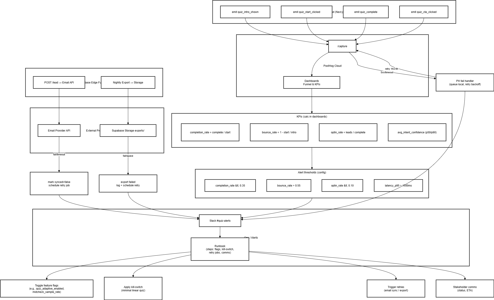

**Fișiere:**  
- [incident-flow.mmd](05-ops-and-observability/incident-flow.mmd)  
- [incident-flow.drawio](05-ops-and-observability/incident-flow.drawio)  

**Descriere detaliată:**  
Diagrama centrală pentru observabilitate pre-MVP.  
- **Evenimente whitelisted** → PostHog: `quiz_intro_shown`, `quiz_start_clicked`, `quiz_complete`, `quiz_cta_clicked`.  
- **KPIs funnel** (calculate în dashboard):  
  - `completion_rate = complete / start`  
  - `bounce_rate = 1 - start / intro`  
  - `optin_rate = leads / complete`  
  - `avg_intent_confidence (p50/p90)`  
- **Thresholds** → Slack alerts (e.g. completion < 0.35, bounce > 0.55, opt-in < 0.10, latency p95 > 1500ms).  
- **Fallback-uri**:  
  - PostHog down → queue local → retry backoff.  
  - Email provider fail → `synced=false` + retry job.  
  - Export fail → log + retry + alert Slack.  
- **Runbook**: Slack alert → toggle flags / kill-switch → trigger retries → stakeholder comms.  

**Tickete impactate:**  
- [Analytics] [AIT-511](https://alexandrafofel.atlassian.net/browse/AIT-511), [AIT-506](https://alexandrafofel.atlassian.net/browse/AIT-506)  
- [OPS] [AIT-507](https://alexandrafofel.atlassian.net/browse/AIT-507), Incident Runbook  
- [FE] [AIT-470](https://alexandrafofel.atlassian.net/browse/AIT-470)  
- [BE] [AIT-510](https://alexandrafofel.atlassian.net/browse/AIT-510)  

---

### 5.2 Deployment View — With Queues & Retries

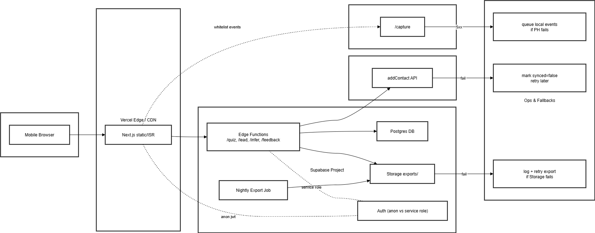

**Fișiere:**  
- [deployment-view.mmd](05-ops-and-observability/deployment-view.mmd)  
- [deployment-view.drawio](05-ops-and-observability/deployment-view.drawio)  

**Descriere detaliată:**  
Arată cum sunt distribuite componentele și fallback-urile:  
- **Frontend** servit din **Vercel Edge/CDN**.  
- **Supabase Project**: Edge Functions (/quiz, /lead, /infer, /feedback), Postgres, Storage, Auth, cron nightly export.  
- **PostHog** pentru analytics.  
- **Email Provider** pentru leads.  
- **Fallback layers**:  
  - q_ph (PostHog fail → queue local).  
  - q_mail (lead unsynced → retry).  
  - q_exp (export fail → retry).  
- **Security**: auth separă anon key (FE) de service role (BE).  

**Tickete impactate:**  
- [OPS] [AIT-507](https://alexandrafofel.atlassian.net/browse/AIT-507)  
- [BE] [AIT-524](https://alexandrafofel.atlassian.net/browse/AIT-524), [AIT-510](https://alexandrafofel.atlassian.net/browse/AIT-510)  
- [Analytics] [AIT-511](https://alexandrafofel.atlassian.net/browse/AIT-511)  
- [FE] [AIT-470](https://alexandrafofel.atlassian.net/browse/AIT-470)  

---

### 5.3 Runbooks (Async)

**Folder:** [`05-ops-and-observability/runbooks/`](05-ops-and-observability/runbooks/)  

**Conținut:**  
- `incident-runbook.md` → pași pentru fallback handling:  
  - PH down → inspect queue → retry  
  - Email provider down → check `synced=false` → rerun sync job  
  - Storage export fail → manual retry + alert stakeholders  
  - Always log in `AUDIT_LOG`  
- `onboarding-tech.md` → overview pentru colegi noi, cu diagrame high-level (C4, Deployment) și explicarea flag-urilor.  

**Rol:**  
- Permite operarea **async/remote** (fără calluri urgente) → claritate cine, ce, când.  
- Asigură consistență între diagrame și pași operaționali.  

**Tickete impactate:**  
- [OPS] [AIT-507](https://alexandrafofel.atlassian.net/browse/AIT-507), Incident Runbook, Export Ops  
- [Analytics] [AIT-506](https://alexandrafofel.atlassian.net/browse/AIT-506)  
---

## 6. ML-Ready API

### 6.1 ML-Ready API Overview

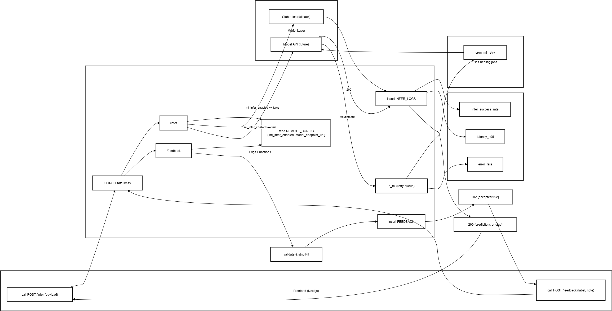

**Fișiere:**  
- [ml-ready-api.mmd](06-ml-ready/ml-ready-api.mmd)  
- [ml-ready-api.drawio](06-ml-ready/ml-ready-api.drawio)  

**Descriere detaliată:**  
- **POST /infer** → decide dacă folosește stub sau model extern (în funcție de flag `ml_infer_enabled` și `model_endpoint_url` în `REMOTE_CONFIG`).  
- **POST /feedback** → salvează etichete manuale (labels, notes) în tabelul `FEEDBACK`.  
- **Fallback-uri**:  
  - dacă `ml_infer_enabled=false` → răspunde cu stub.  
  - dacă modelul dă eroare → fallback stub + log în `INFER_LOGS`.  
- **Export Ops**: feedback-ul și logurile se exportă nightly în Storage, **ops-only** (nu direct în model).  
- **DB tables**:  
  - `FEEDBACK` — manual labels.  
  - `INFER_LOGS` — input/output + latency.  

**Procese modelate:**  
- Flag-driven routing (stub vs model).  
- Safe-logging pentru toate apelurile.  
- Validare și curățare PII pentru feedback.  

**Tickete impactate:**  
- [BE] (pregătire pentru viitor, nu obligatoriu pre-MVP)  
- [OPS] Export feedback ops-only  

---

### 6.2 Sequence — /infer

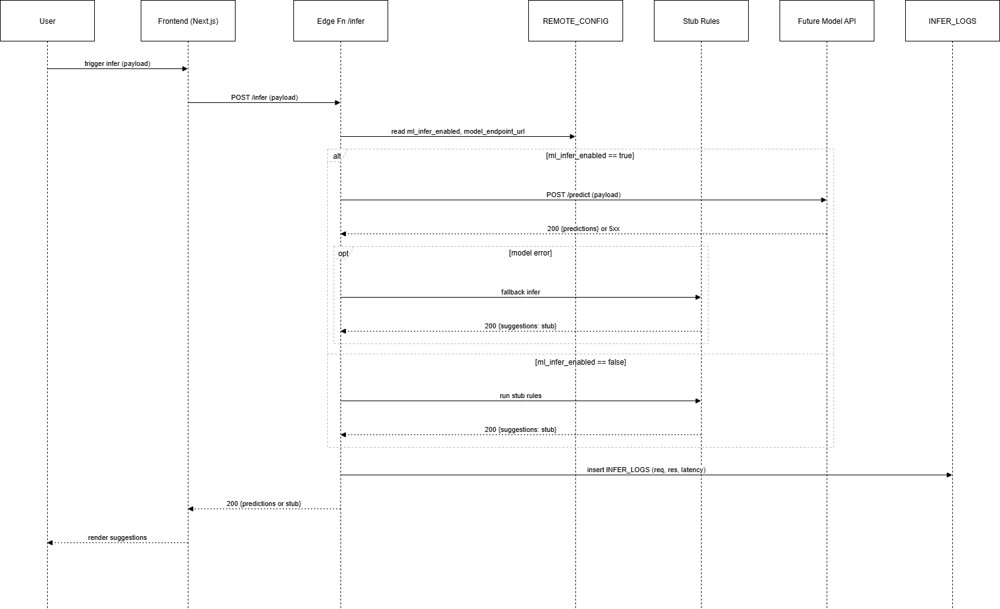

**Fișiere:**  
- [ml-infer-sequence.mmd](06-ml-ready/ml-infer-sequence.mmd)  
- [ml-infer-sequence.drawio](06-ml-ready/ml-infer-sequence.drawio)  

**Descriere detaliată:**  
- User → FE → Edge Fn `/infer`.  
- Edge citește config → decide stub sau model extern.  
- Model poate răspunde 200 sau 5xx.  
- Dacă eroare sau disabled → stub răspunde cu sugestii fallback.  
- Toate request/response sunt logate în `INFER_LOGS`.  

**Tickete impactate:**  
- [BE] (future)  
- [OPS] Export INFER_LOGS pentru audit/antrenament  

---

### 6.3 Sequence — /feedback

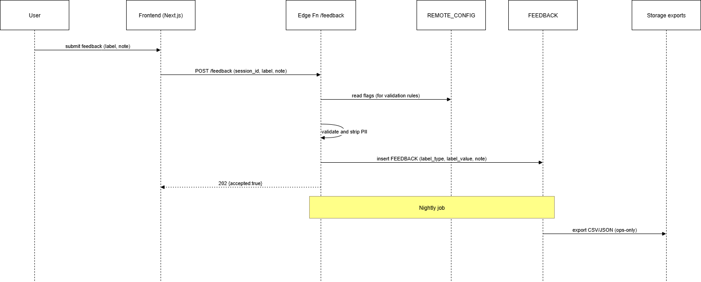

**Fișiere:**  
- [ml-feedback-sequence.mmd](06-ml-ready/ml-feedback-sequence.mmd)  
- [ml-feedback-sequence.drawio](06-ml-ready/ml-feedback-sequence.drawio)  

**Descriere detaliată:**  
- User trimite feedback prin FE → Edge Fn `/feedback`.  
- Edge → validează payload, curăță PII.  
- Inseră în `FEEDBACK` (label_type, value, note).  
- Returnează `202 {accepted:true}` către FE.  
- Nightly job → export în Storage pentru OPS (nu consum model direct).  

**Tickete impactate:**  
- [OPS] Export feedback ops-only  
- [BE] (future) pregătire pentru supervised training loop  

---

## 7. Traceability Matrix

Această secțiune mapează **ticketele Jira** pe categorii (FE, BE, OPS, Analytics) la **diagramele asociate**.  
Scopul: asigurăm că **toate cerințele pre-MVP sunt acoperite vizual** și că nu există goluri sau conflicte.

| Ticket | Categoria | Descriere | Diagrame asociate |
|--------|-----------|-----------|-------------------|
| [AIT-470](https://alexandrafofel.atlassian.net/browse/AIT-470) | [FE] | Static quiz prototype | Context, State Machine, Control Flow, Sequence, Functions Overview, Feature Flags Map, GET/POST quiz, POST lead, Data Flow, Deployment, Incident Flow |
| [AIT-469](https://alexandrafofel.atlassian.net/browse/AIT-469) | [FE] | UI/UX quiz flow | State Machine, Control Flow, Component Detailed, Functions Overview |
| [AIT-505](https://alexandrafofel.atlassian.net/browse/AIT-505) | [FE] | UTM tagging | Functions Overview, Component Detailed |
| [AIT-504](https://alexandrafofel.atlassian.net/browse/AIT-504) | [FE] | Pilot Test | State Machine, Control Flow |
| [AIT-509](https://alexandrafofel.atlassian.net/browse/AIT-509) | [BE] | Schema DB | ERD, RLS, Data Flow, Component Detailed |
| [AIT-524](https://alexandrafofel.atlassian.net/browse/AIT-524) | [BE] | API integration | Component, Deployment, Sequence, GET/POST quiz, POST lead |
| [AIT-510](https://alexandrafofel.atlassian.net/browse/AIT-510) | [BE] | Save answers/email | Deployment, Sequence, POST quiz, POST lead, Incident Flow |
| [AIT-511](https://alexandrafofel.atlassian.net/browse/AIT-511) | [Analytics] | Event tracking | captureEvent, Sequence, Incident Flow, Feature Flags Map, Data Flow |
| [AIT-506](https://alexandrafofel.atlassian.net/browse/AIT-506) | [Analytics] | Funnel dashboards | Incident Flow, Data Flow, Component Detailed |
| [AIT-507](https://alexandrafofel.atlassian.net/browse/AIT-507) | [OPS] | Arhitectură pre-MVP | Context, Deployment, Incident Flow, Runbooks |
| CSV Import (Ops) | [OPS] | Import content | CSV Loader, Component Detailed |
| Export Ops (nightly) | [OPS] | Export answers/leads | Data Flow, Deployment, Incident Flow |
| Incident Runbook (Ops) | [OPS] | Incident handling | Incident Flow, Runbooks |

---

