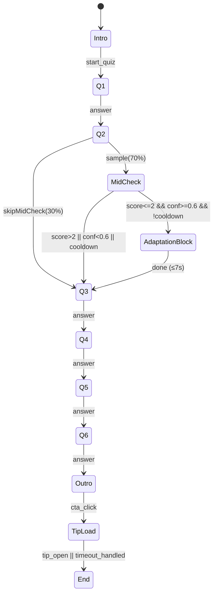

0) Meta
Document: Quiz Intro – Logică adaptivă (state machine)

Versiune: v1.0 (ready-to-ship, MVP harden)

Scope: definire deterministă a stărilor, tranzițiilor, gardurilor, acțiunilor și telemetriei.

1) Overview (ce face engine-ul)
Obiectiv: finalizează quiz-ul în ≤60s median, personalizează outro și injectează max 1 micro-adaptare când progresul perceput e scăzut și avem intenție clară.

Principii: previzibilitate (Norman), viteză & valoare rapidă (Torres), fără PII, fallback sigur (Clarity_min).

2) Model de date (runtime)
```ts
type IntentProfile = "Norman" | "Torres" | "Neutral";
type Branch = "Norman" | "Torres" | "Neutral" | "Clarity_min";
type ProgressType = "emotional" | "clarity" | "reflection" | "confirmation" | "unknown";

interface SessionCtx {
  session_id: string;
  variant: "control" | "adaptive";
  device: "mobile" | "desktop";
  net_type: "3G" | "4G" | "WiFi";
  // Intent
  intent_profile: IntentProfile;
  intent_confidence: number; // 0..1
  // Progress measurement
  progress_mid_score?: number; // 1..5 (Q0.5)
  progress_type_detected?: ProgressType;
  // Adaptation
  cooldown_used: boolean; // max 1 adaptare/quiz
  branch_applied?: Branch;
  // Content
  q_index: 1|2|3|4|5|6;
  baby_wording: boolean; // Q2 < 2y
}
```
3) Stări & tranziții (MVP)
3.1 Stări
Intro

Q1..Q6 (loop întrebare-cu-întrebare, 1/ecran)

MidCheck (Q0.5 – 70% sample după Q2)

AdaptationBlock (inserție unică, ≤7s)

Outro

TipLoad (deschiderea recomandării)

End

3.2 Diagrama (Mermaid)

4) Garduri (guards) & SLO
Trigger adaptare: progress_mid_score ≤ 2 și intent_confidence ≥ 0.6 și cooldown_used == false.

Cooldown: cooldown_used = true după orice adaptare (hard cap 1).

Fallback determinist: dacă nu treci gardurile → branch = "Clarity_min".

SLO timp:

answer_time_median_per_q ≤ 8.5s; P95 ≤ 15s

feedback_latency_p95 ≤ 1500ms

total_quiz_p95 ≤ 80s

5) Inferență intenție (MVP rules, Q1–Q2)
```ts
function inferIntent(features:{
  dwell_ms_q1:number, dwell_ms_q2:number,
  backtracks:number, clicked_preview:boolean,
  chose_action_opt:boolean, emotion_kw_score:number,
  night_mode:boolean, skipped_validation:boolean
}): {profile:IntentProfile, confidence:number, used:string[]} {
  const used:string[] = [];
  let scoreNorman = 0, scoreTorres = 0;

  if (features.emotion_kw_score>=1){scoreNorman++; used.push("emo_kw");}
  if (((features.dwell_ms_q1+features.dwell_ms_q2)/2)>7000){scoreNorman++; used.push("dwell_high");}
  if (features.night_mode){scoreNorman++; used.push("night");}
  if (features.backtracks===0){scoreNorman++; used.push("no_backtrack");}

  if (features.clicked_preview || features.chose_action_opt){scoreTorres++; used.push("action_signal");}
  if (((features.dwell_ms_q1+features.dwell_ms_q2)/2)<6000){scoreTorres++; used.push("dwell_low");}
  if (features.skipped_validation){scoreTorres++; used.push("skip_val");}

  const delta = scoreTorres - scoreNorman;
  const profile = delta>=1 ? "Torres" : delta<=-1 ? "Norman" : "Neutral";
  const confidence = Math.min(1, Math.abs(delta)/3);
  return {profile, confidence, used};
}
```
6) Mappare adaptare & outro
Context	Branch/adaptare (≤7s)	Outro copy
intent=Norman & trigger	Mesaj validare + 1 micro-întrebare de relief	out_norman_v1
intent=Torres & trigger	Hint practic + checklist 1 pas	out_torres_v1
intent=Neutral & trigger	Preview rezultat scurt	out_neutral_v1
Garduri neîndeplinite	Clarity_min (text neutru de clarificare)	out_neutral_v1
Q2<2y	—	out_* + out_baby_v1 wording

Hard rule: max 1 adaptare/quiz (cooldown). Nicio schimbare de ordine a întrebărilor.

7) Pseudocod flux (detaliat)
```ts
function runQuiz(ctx: SessionCtx) {
  showIntro(); // emit quiz_intro_shown
  waitStart(); // emit quiz_start_clicked

  for (ctx.q_index = 1; ctx.q_index <= 6; ctx.q_index++) {
    renderQuestion(ctx.q_index); // emit quiz_question_shown
    const ans = await getAnswer(); // emit quiz_answer_submitted{time_on_question_ms, chosen_option_tags}
    if (ctx.q_index === 1) cacheFeatures(ans);
    if (ctx.q_index === 2) {
      const intent = inferIntent(collectEarlyFeatures());
      ctx.intent_profile = intent.profile;
      ctx.intent_confidence = intent.confidence;
      emit("quiz_intent_inferred", intent);
      ctx.baby_wording = checkBaby(ans); // Q2 <2y
      // Q0.5 mid-progress (70%)
      if (sample70()) {
        const score = await askMidProgress(); // 1..5
        ctx.progress_mid_score = score;
        emit("quiz_progress_update", {score});
        if (score <= 2 && ctx.intent_confidence >= 0.6 && !ctx.cooldown_used) {
          const branch = mapBranch(ctx.intent_profile);
          applyAdaptation(branch); // ≤7s UI block
          ctx.cooldown_used = true;
          ctx.branch_applied = branch;
          emit("quiz_adaptation_triggered", {branch, cooldown_active:true});
        } else if (score <= 2 && !ctx.cooldown_used) {
          applyAdaptation("Clarity_min");
          ctx.cooldown_used = true;
          ctx.branch_applied = "Clarity_min";
          emit("quiz_adaptation_triggered", {branch:"Clarity_min", cooldown_active:true});
        }
      }
    }
  }

  const outroId = pickOutro(ctx.intent_profile, ctx.baby_wording);
  showOutro(outroId); // emit quiz_complete{final_progress_type, ...}

  onCTAClick((cta)=>{
    emit("quiz_cta_clicked", {cta_id:cta.id, copy_id:outroId, cta_position:"outro"});
    showTipSkeleton(); // feedback ≤1500ms P95
    openTip().then(()=>{
      emit("calm_tip_open",{tip_id:cta.tip});
      end();
    }).catch(handleLatencyOrOffline);
  });
}
```
8) Telemetrie (hook-uri obligatorii)
quiz_intro_shown, quiz_start_clicked

quiz_question_shown, quiz_answer_submitted{time_on_question_ms, chosen_option_tags, backtracked, tap_errors}

quiz_intent_inferred{intent_profile, intent_confidence, features_used}

quiz_progress_update{perceived_progress_score, progress_type_detected?, branch_used?}

quiz_adaptation_triggered{branch_applied, cooldown_active=true}

quiz_complete{completion_time_sec, final_progress_type, progress_delta}

quiz_cta_clicked{cta_id, cta_label, cta_position:'outro', copy_id}

calm_tip_open{tip_id}

Perf signals: lcp_ms, ttfb_ms, feedback_latency_ms (P95 ≤1500).

9) Feature flags & remote config
```json
{
  "quiz_adaptive_enabled": true,
  "midcheck_sample_rate": 0.7,
  "intent_conf_threshold": 0.6,
  "adaptation_cooldown_max": 1,
  "latency_feedback_threshold_ms": 1500,
  "baby_wording_enabled": true
}
```
Kill-switch: quiz_adaptive_enabled=false ⇒ dezactivezi AdaptationBlock, forțezi Clarity_min.

10) Resiliență & edge cases
Double-tap CTA: debounce 500ms; log un singur quiz_cta_clicked.

Back navigation: păstrează selecțiile; nu re-emite question_shown.

Offline/latency: skeleton + mesaj “Se încarcă recomandarea…”; retry 1×; dacă eșuează → toast “Conexiune slabă, reîncercăm…” și oferă salvare offline a tip-ului (optional).

Small devices (≤320px): max 3 opțiuni/ecran dacă wrap >2 linii; tap target ≥48px.

A11y: aria-live="polite" pentru AdaptationBlock; focus management pe inserție; CTA anunțat role=button.

11) QA / Acceptance (DoD logic)
Determinism: 6 întrebări, max 1 adaptare, 0 dead-ends.

Timpi: mediana per Q ≤8.5s; P95 ≤15s; total P95 ≤80s.

Perf: LCP p75 ≤2.5s; feedback P95 ≤1500ms.

Personalizare: Outro selectat de intent_profile (+ baby wording dacă Q2<2y).

Evenimente: unice, ordonate; coverage ≥97% pe MVP vars.

Safety: disclaimer disponibil când contextul o cere.

12) Teste E2E minime (automatizabile)
Norman trigger: Q0.5=2, conf=0.8 ⇒ AdaptationBlock(Norman); cooldown_used=true.

Torres trigger: Q0.5=1, conf=0.7 ⇒ AdaptationBlock(Torres).

Low-conf fallback: Q0.5=2, conf=0.4 ⇒ Clarity_min.

No adapt: Q0.5≥3 ⇒ direct Q3.

Baby wording: Q2 <2y ⇒ outro include out_baby_v1.

Debounce CTA: dublu click ⇒ 1 singur quiz_cta_clicked.

Back/forward: schimbă Q2, persistă selecții, evenimente corecte.

Latency 3G: feedback P95 ≤1500ms cu skeleton.

A11y smoke: VoiceOver/TalkBack anunță adaptarea; focus order corect.

Kill-switch: flag OFF ⇒ niciun quiz_adaptation_triggered.

13) Observabilitate & alerte
Slack alerts: completion_drop >5pp/1h; feedback_p95_ms >1500/30m; tap_error_rate >1.5%/30m.

Dashboards minime: funnel, time-per-Q, adaptation impact (uplift CTR/Activation), perf (LCP/feedback).

14) Note de implementare
Nu reordona întrebările în MVP; adaptarea este inserție scurtă, nu branch complet.

Option tags (emo_validare, clarificare, actiune_pas, profil, profil_safe) trebuie să existe în content pentru inferență.

Copy IDs pentru outro (ex. out_norman_v1) sunt parte din telemetrie (copy_id).

Acest fișier definește sursa de adevăr pentru logică. Orice schimbare de garduri/flaguri se face prin remote config + versiune nouă a documentului.
